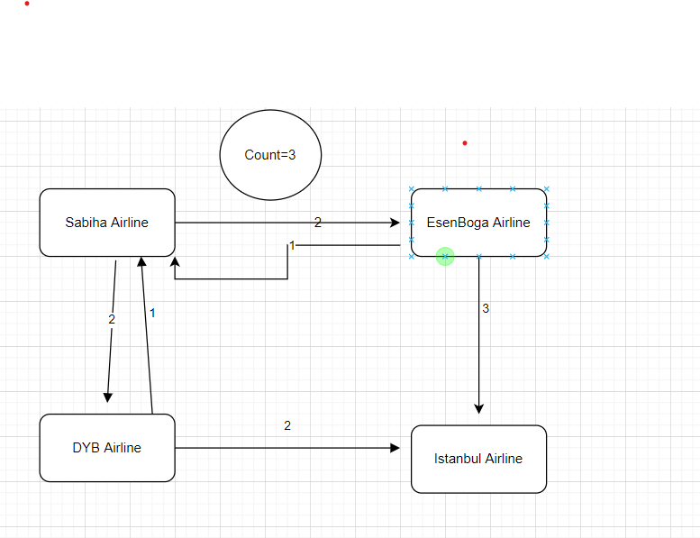

When determining all possible flight plans for a person who wants to travel between two different cities served by an airline;
Sabiha--------->Esenboga or Esenboga ------>There can be a maximum of 3 flights on the same day between Sabiha.
This is how the solution was designed

I preferred to use MySql because it is installed in my local
POST Method url :http://localhost:8181/api/flightPlans/
examples request:
{
"departureAirportCode": "DYB",
"arrivalAirportCode": "SAbiha",
"departureDate": "2022-05-16T10:38",
"arrivalDate": "2022-05-16T11:20",
"planeName": "Pegasus"
}

GET Method url :http://localhost:8181/api/flightPlans/
[
{
"id": 1,
"departure_Airline_Code": "01A",
"arrival_Airline_Code": "01B",
"departure_Date": [
2016,
10,
6,
10,
34
],
"arrival_Date": [
2016,
10,
6,
10,
34
],
"flight_Date": [
2016,
10,
6
],
"planeName": "thy"
]

SELECT * FROM flightplan.flights_plane;CREATE TABLE `flights_plane` (
`id` bigint NOT NULL AUTO_INCREMENT,
`flight_date` date DEFAULT NULL,
`plane_name` varchar(255) DEFAULT NULL,
`arrival_airline_code` varchar(255) DEFAULT NULL,
`arrival_date` datetime(6) DEFAULT NULL,
`departure_airline_code` varchar(255) DEFAULT NULL,
`departure_date` datetime(6) DEFAULT NULL,
PRIMARY KEY (`id`)
)